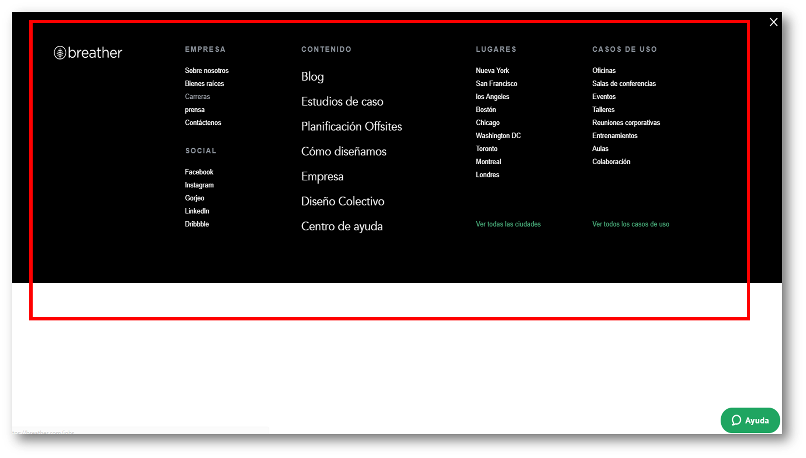
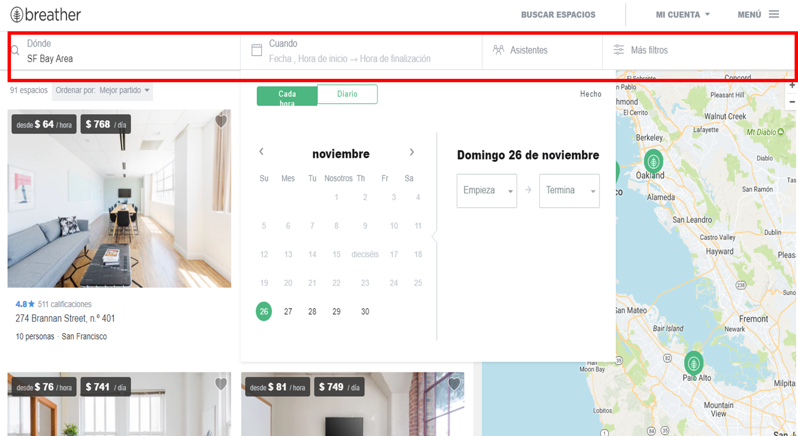
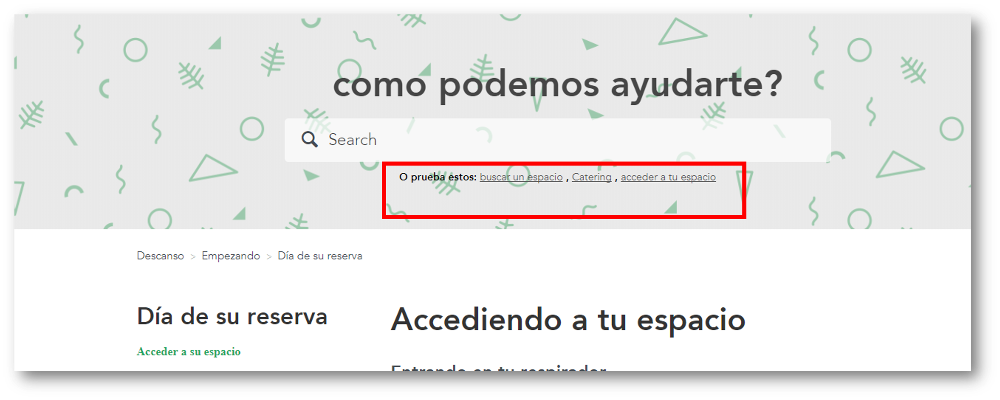
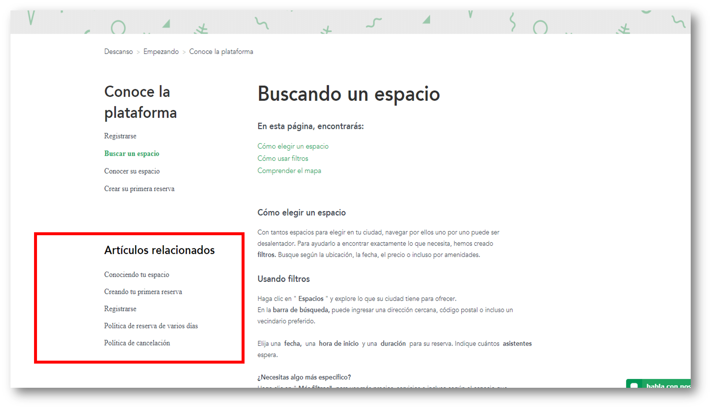
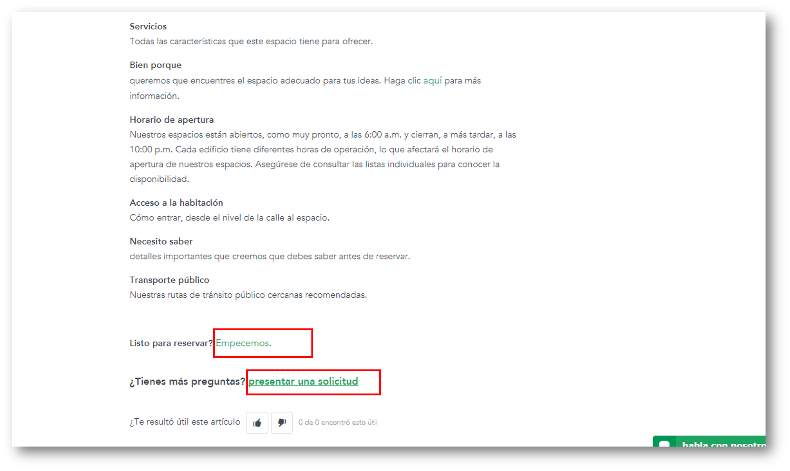

# BREATHER (elementos de navegación)

* **Curso:** _Creando tu primer sitio web interactivo_
* **Unidad:** _Intro a User Experience Design_

## Objetivo

Identificar los elementos de navegación de la wesite **Breather**.

## Alumna
* Maria Cristina Ortiz Villafuerte.

## Descripción

Se muestra la identificación de los elementos de navegación de la wewbsite **Breather**:

### Navegación global

### Navegación local

### Navegación local-filtrada

Se identificó que la parte seleccionada es navegación local porque como página interna tienen su propia navegación que ayuda al usuario a explorar esa vista en particular; y filtrada porque le damos una serie de opciones de filtros para que él mismo pueda filtrar por lugar, fecha, etc a la hora de ubicar un espacio en breather.

### Navegación facetada

### Navegación contextual

### Navegación inline

